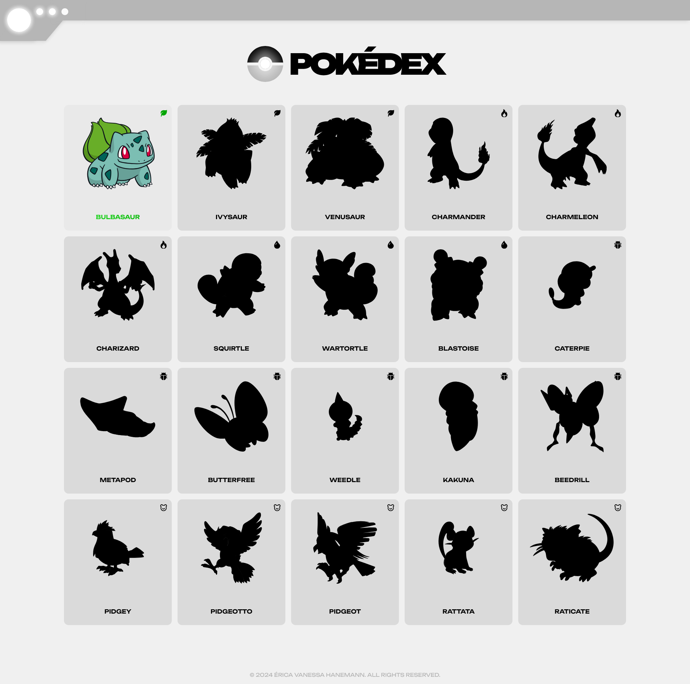
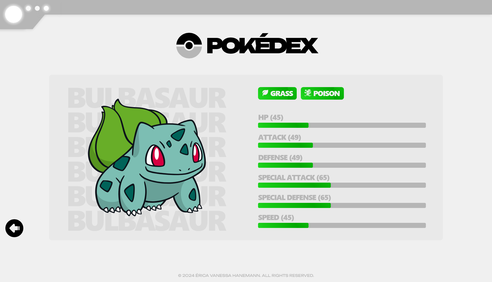

# Pokédex

An app developed for a technical interview at Reverbs. The app connects to the [PokéAPI](https://pokeapi.co/) to fetch data and display a list of Pokémons. Users can browse through the list, and by clicking on a Pokémon, view detailed information such as its stats and types.

<p>
  <a href="#layout">Layout</a>&nbsp;&nbsp;&nbsp;|&nbsp;&nbsp;&nbsp;
  <a href="#installation">Installation</a>&nbsp;&nbsp;&nbsp;|&nbsp;&nbsp;&nbsp;
  <a href="#technologies">Technologies</a>&nbsp;&nbsp;&nbsp;|&nbsp;&nbsp;&nbsp;
  <a href="https://pokedex-eh.vercel.app/" target="_blank">Live Demo</a>
</p>

## Layout

- **Home Page**: Displays a list of Pokémons fetched from the API.
  

- **Pokémon Page**: Shows detailed information about the selected Pokémon.
  

## Installation

Follow these steps to set up the project locally:

1. **Clone the repository**
   ```bash
   git clone https://github.com/ericahanemann/pokedex.git 
   ```

2. **Navigate to the project directory**
   ```bash
   cd pokedex
   ```

3. **Install dependencies**
   ```bash
   npm install
   ```

4. **Run the development server**
   ```bash
   npm run dev
   ```

5. **Access the application**
   Open [http://localhost:5173](http://localhost:5173) in your browser.

## Technologies

This project was developed using the following technologies and libraries:

- **Vite** 
- **React** 
- **JavaScript** 
- **CSS Modules** 
- **NPM** 
- **Axios** 
- **React Router** 
- **React Icons** 
- **React Parallax Tilt** 

## Live Demo

Check out the live version of the project here:
[**Live Demo**](https://pokedex-eh.vercel.app/)


